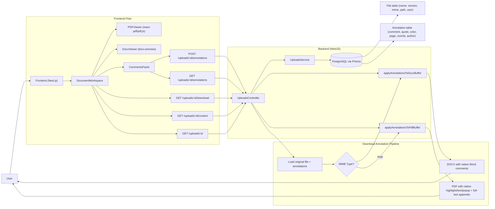
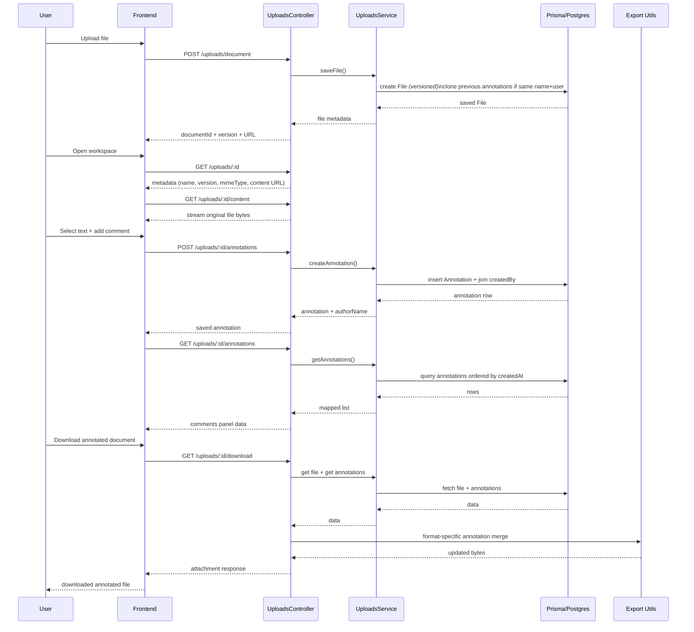

# Document Annotation Architecture

This document is the detailed technical reference for the current implementation of:

- document viewing (PDF and DOCX)
- text selection and annotation creation
- annotation persistence and versioning
- annotated document export/download

The same content is mirrored in backend for cross-team visibility.

## 1. Scope and Current Behavior

### Supported document types
- PDF (`application/pdf`)
- DOCX (`application/vnd.openxmlformats-officedocument.wordprocessingml.document`)

### High-level behavior
1. User uploads document.
2. Workspace renders PDF or DOCX preview.
3. User selects text and creates annotations from comments panel.
4. Annotation metadata is stored in DB.
5. User downloads annotated file.
6. Backend applies annotations natively per format:
- DOCX: true Word comments in OOXML
- PDF: native PDF annotations (`Highlight`, `Text`, `Popup`) plus full-text appendix pages

### Non-goals in current implementation
- multi-user live collaboration on same document session
- exact glyph-level mapping for every PDF engine variant
- perfect comment popup behavior consistency across all browser PDF renderers

## 2. End-to-End Architecture

## 3. Sequence Flow

## 4. Frontend Implementation

### 4.1 Main modules
- `src/features/documents/components/DocumentWorkspace.tsx`
- `src/features/documents/components/PDFViewer.tsx`
- `src/features/documents/components/DocxViewer.tsx`
- `src/features/documents/components/CommentsPanel.tsx`
- `src/features/documents/services/annotation-api.ts`
- `src/features/documents/types/annotation.ts`

### 4.2 Workspace responsibilities
`DocumentWorkspace` orchestrates:
- document loading
- current page state
- pending text selection state
- hover linkage between comment list and viewer highlight
- download action state (`Preparing...`)

### 4.3 Viewer behavior
PDF viewer:
- powered by `react-pdf` and `pdfjs-dist`
- virtualized page rendering and page ratio tracking
- selection capture from text layer ranges

DOCX viewer:
- powered by `docx-preview` `renderAsync`
- style-preserving render options
- page mapping via `.docx-page` DOM blocks
- selection capture from browser range rects

### 4.4 Selection capture model
Both viewers emit:
- `pageNumber`
- selected `text`
- absolute rect values (`x`, `y`, `width`, `height`)
- normalized rect values (`normalizedX`, `normalizedY`, `normalizedWidth`, `normalizedHeight`)

Normalization exists so export logic can remap annotations to real page dimensions during download.

### 4.5 Comments panel behavior
`CommentsPanel`:
- loads existing annotations on mount (`GET /annotations`)
- allows color selection from preset palette
- submits annotation payload (`POST /annotations`)
- groups comments by page
- supports hover-to-highlight linkage and jump-to-page action
- renders author and color metadata

### 4.6 Viewer UI decision
Tooltip-style comment bodies were intentionally removed from in-app viewer.
Current decision: downloaded file should be source of truth for native comment behavior in external viewers.

## 5. Backend Implementation

### 5.1 Main modules
- `src/uploads/uploads.controller.ts`
- `src/uploads/uploads.service.ts`
- `src/uploads/dto/create-annotation.dto.ts`
- `src/uploads/docx-annotation.util.ts`
- `src/uploads/pdf-annotation.util.ts`
- `prisma/schema.prisma`

### 5.2 Endpoint map
- `POST /uploads/document`
  - validates file type/size
  - saves binary to uploads directory
  - creates DB file record with versioning
- `GET /uploads/:id`
  - workspace metadata
- `GET /uploads/:id/content`
  - raw file stream with range support (for viewer performance)
- `POST /uploads/:id/annotations`
  - create annotation row
- `GET /uploads/:id/annotations`
  - list annotation rows
- `GET /uploads/:id/download`
  - returns transformed file with annotations embedded

### 5.3 Security and ownership
- all upload routes are protected by JWT guard
- file access is scoped by `uploadedById == currentUser`
- users cannot annotate/download another user's file record

## 6. Data Model and Contracts

### 6.1 Prisma entities (summary)
`File`
- `id`, `name`, `version`, `path`, `size`, `mimeType`
- `uploadedById`, timestamps
- unique per `(uploadedById, name, version)`

`Annotation`
- `comment`, `quotedText`, `highlightColor`
- `page`
- absolute geometry: `x`, `y`, `width`, `height`
- normalized geometry: `normalizedX`, `normalizedY`, `normalizedWidth`, `normalizedHeight`
- relation to `File` and `User`

### 6.2 Annotation API payload
Create request includes:
- business fields: comment, quotedText, page, highlightColor
- geometry fields: both absolute and normalized coordinates

Response includes:
- annotation row
- computed `authorName` from user profile (`name` > `email` > `"Unknown"`)

## 7. Versioning Strategy

When uploading a file:
1. lookup previous file by same `name` and same `uploadedById`
2. compute `nextVersion = previous.version + 1` else `1`
3. create new file record
4. if previous annotations exist, clone them into new file record

Result:
- re-uploading same filename gives historical continuity
- annotations auto-populate for new version

## 8. Download Pipeline

`GET /uploads/:id/download` performs:
1. verify user owns file record
2. read stored file bytes
3. fetch annotations for file ID
4. route by mime type:
- DOCX -> `applyAnnotationsToDocxBuffer`
- PDF -> `applyAnnotationsToPdfBuffer`
- others -> pass-through stream
5. send transformed bytes as attachment with original filename

## 9. DOCX Export Internals

Implementation file:
- `src/uploads/docx-annotation.util.ts`

### 9.1 Approach
DOCX is a ZIP package of OOXML parts.
The util:
1. opens package entries via zip helpers
2. reads `word/document.xml`
3. ensures/reads `word/comments.xml`
4. anchors comment ranges to matched runs
5. appends `<w:comment>` records
6. ensures relationship and content-type declarations
7. rewrites ZIP and returns new DOCX bytes

### 9.2 XML parts touched
- `word/document.xml`
- `word/comments.xml`
- `word/_rels/document.xml.rels`
- `[Content_Types].xml`

### 9.3 Anchoring strategy
- uses quoted text matching in run text
- splits run around matched quote
- injects:
  - `w:commentRangeStart`
  - `w:commentRangeEnd`
  - `w:commentReference`

Fallback:
- if exact in-run anchoring is not possible, reference markers are appended before `</w:body>` so comment content remains available.

## 10. PDF Export Internals

Implementation file:
- `src/uploads/pdf-annotation.util.ts`

### 10.1 Approach
For each annotation:
1. map normalized values to PDF page coordinates
2. draw translucent rectangle as visual fallback
3. create native `/Highlight` annotation
4. create native `/Text` note annotation (author + comment)
5. create linked `/Popup` annotation
6. add annotation refs to page `Annots`

### 10.2 Long comment handling
- comment text is normalized with soft line breaks for viewer friendliness
- a "Comments Appendix (Full Text)" section is appended at end of PDF
  - contains every comment in full text with index/page/author
  - acts as fallback when browser popup rendering clips long content

### 10.3 Why appendix exists
Browser PDF viewers are inconsistent and often cap popup UI rendering.
Native annotations are still present, but appendix guarantees complete content in the downloaded file.

## 11. Libraries and Responsibilities

### Frontend libraries
- `react-pdf` + `pdfjs-dist`
  - PDF preview and text selection source
- `docx-preview`
  - browser DOCX render with style support
- `axios` (shared API client)
  - API communication

### Backend libraries
- `pdf-lib`
  - PDF read/write and low-level annotation objects
- `yauzl` + `yazl`
  - DOCX zip package read/write
- `NestJS`
  - REST API and middleware stack
- `Prisma`
  - ORM and DB access

## 12. Error Handling and Fallbacks

### Frontend
- load errors surfaced in viewer panels
- selection ignored if invalid/empty or outside viewer
- download button has pending state

### Backend
- 404 when file record missing or not owned by user
- 404 when stored file path missing
- range requests validated for streamed content
- if no annotations exist, original buffer is returned unchanged

## 13. Known Limitations

1. Browser PDF popup rendering can clip long comments (appendix mitigates).
2. Selection anchoring precision can vary with complex source documents:
- PDF text layers differ by renderer/font extraction
- DOCX run segmentation can split expected quoted text
3. Cross-viewer behavior differs:
- Adobe Reader, browser viewer, and Office do not render annotation UX identically

## 14. Validation and Testing Checklist

Use this checklist for manual regression:

1. Upload PDF, add short comment, download, verify highlight + note.
2. Upload PDF, add very long comment, verify:
- popup content exists
- full comment exists in appendix page(s).
3. Upload DOCX with rich formatting, verify preview style retention.
4. Add DOCX comment, download, open in Word, verify native comment appears.
5. Re-upload same filename, verify version increments and previous annotations load.
6. Verify author name appears in comments panel and export metadata.
7. Verify color selection persists and is reflected in export.

## 15. File Reference Index

### Frontend
- `src/features/documents/components/DocumentWorkspace.tsx`
- `src/features/documents/components/PDFViewer.tsx`
- `src/features/documents/components/DocxViewer.tsx`
- `src/features/documents/components/CommentsPanel.tsx`
- `src/features/documents/services/annotation-api.ts`
- `src/features/documents/types/annotation.ts`

### Backend
- `src/uploads/uploads.controller.ts`
- `src/uploads/uploads.service.ts`
- `src/uploads/dto/create-annotation.dto.ts`
- `src/uploads/docx-annotation.util.ts`
- `src/uploads/pdf-annotation.util.ts`
- `prisma/schema.prisma`

## 16. Future Enhancements (Optional)

1. Robust text anchoring IDs:
- persist text offset tokens or content hashes for better remapping after layout shifts.
2. Rich annotation filters:
- by author, color, page range, date.
3. Better PDF interop:
- targeted compatibility tuning per renderer (Adobe/Chrome/Edge).
4. Automated integration tests:
- golden-file comparison for exported PDF/DOCX annotations.

